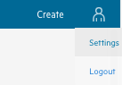
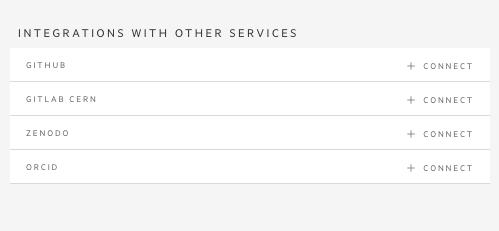

## Connecting CAP with git repositories

We have already created a new CAP entry, added some metadata (datasets, triggers information) and uploaded files. Now it's time to tell us, where is the code that you used in your analysis.

It is possible to connect an external account (Github, CERN Gitlab, ORCiD, Zenodo. . . ) with the CAP account, to automate tasks and content submission. One can just add the current repository content from the tarball or create a connection (webhook) so that everytime
something is changed, the CAP is automatically updated. Let's try it out using your CERN Gitlab account!

In general, if you want to connect a public repository, you don't need to connect your account. CERN Gitlab is an exception, as
 even public repositories require a CERN authentication. So let's first connect your account.

1. Open CAP in a new tab
2. Click on your account icon and go to `Settings`

3. Choose `+ CONNECT` next to `GITLAB CERN` and connect your account

Now let's go back to your open analysis in the previous tab:
1. Go to the menu on your left and click on the connection symbol (third icon)
2. Right now you should see no repositories connected with your analysis
3. Add our analysispreservation repository link
~~~
https://github.com/cernanalysispreservation/analysispreservation.cern.ch
~~~

4. You can see 3 options
    * upload a snapshot (it's like downloading a file - it will make a snapshot of a repo at this moment and no future changes will be reflected in your analysis)
    * connect repository (make connection between your repository and this analysis - get notified every time somebody pushed changes to this repo)
    * upload snapshot & connect (combines both, download now and everytime something was pushed to this repository)
Let's test option 3

FIXME

{: .language-yaml}
