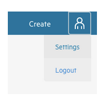
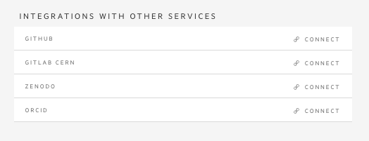
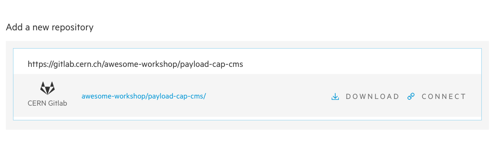

## Connecting CAP with Git repositories

We have already created a new CAP entry, added some metadata (datasets, triggers information) and uploaded files. Now it's time to tell us, where is the code that you used in your analysis.

It is possible to connect an external account (Github, CERN Gitlab, ORCiD, Zenodo. . . ) with the CAP account, to automate tasks and content submission. One can just add the current repository content from the tarball or create a connection (webhook) so that everytime
something is changed, the CAP is automatically updated. Let's try it out using your CERN Gitlab account!

In general, if you want to connect a public repository, you don't need to connect your account. CERN Gitlab is an exception, as
 even public repositories require a CERN authentication. So let's first connect your account.

1. Open CAP in a new tab
2. Click on your account icon and go to `Settings`

3. Choose `+ CONNECT` next to `GITLAB CERN` and connect your account

Now let's go back to your open analysis in the previous tab:
1. Go to the menu on your left and click on the connection symbol (third icon)
2. Right now you should see no repositories connected with your analysis
3. To change it let's use our repository created specially for you for this workshop!
~~~
https://gitlab.cern.ch/awesome-workshop/payload-cap-cms
~~~

4. We have two options:
    * download - like downloading a file - it will make a snapshot of a repo at this moment and attach it to your analysis files (you will find it with other files in your `File Manager`)
    * connect - create a link between your repository and analysis. This way you can keep your analysis up to date with your code changes - we will make a snapshot of each new version of your code and attach it to your analysis for you.

    First option is useful for repositories, that you use, but not maintain, or when your analysis code is already in its final state. For analysis that are still in progress we recommend a second option.

FIXME download repo and download file, pics

{: .language-yaml}
